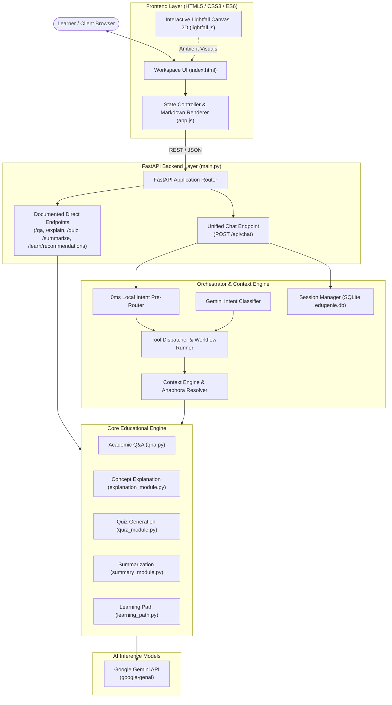

<<<<<<< HEAD
# EduGenie — Google Gemini Powered Learning Assistant

[](https://www.python.org/)
[](https://fastapi.tiangolo.com/)
[](https://ai.google.dev/)
[](LICENSE)

**EduGenie** is an intelligent, AI-native educational learning assistant engineered to empower students and independent learners with on-demand academic tutoring. By harnessing the language comprehension capabilities of Google Gemini through an asynchronous FastAPI backend and a distraction-free web workspace, EduGenie unifies five foundational pedagogical services into a single responsive platform.

---

## 1. Features

### Core Capabilities (Original Document Requirements)
1. **Academic Question & Answer (`/qa`):** Clear, factually grounded answers to direct student inquiries across academic subjects.
2. **Simplified Concept Explanation (`/explain`):** Plain-English breakdowns of complex topics using everyday analogies and simplified vocabulary (with automated fallback from local Hugging Face `LaMini-Flan-T5` model to Gemini).
3. **Interactive Quiz Generation (`/quiz`):** Dynamic generation of 3-question multiple-choice quizzes with 4 options and validated answer keys.
4. **Educational Text Summarization (`/summarize`):** Distills dense academic passages into bulleted Key Takeaways and a concise 3-sentence summary.
5. **Personalized Learning Paths (`/learn/recommendations`):** 3-tiered roadmaps organized into Beginner, Intermediate, and Advanced milestones.

### Enhanced Conversational Capabilities
- **Intelligent Auto Intent Routing:** Fast 0ms local keyword pre-router and few-shot Gemini classifier automatically dispatching user queries without requiring manual task selection.
- **Multi-Turn Conversational Memory:** Context engine that resolves anaphoric follow-up references (*"explain that simpler"*, *"quiz me on it"*, *"give an example"*).
- **Persistent SQLite Session Storage:** Thread-safe SQLite persistence (`edugenie.db`) ensuring student chat history survives server restarts.
- **Interactive Quiz Widget:** Clickable option buttons providing immediate green (correct) and red (incorrect) visual evaluation and session score tracking.
- **Premium AI Workspace UI:** Deep space theme (`#050510`) with centered hero, minimal header, and docked composer.
- **Interactive Ambient Lightfall Background:** Custom GPU-accelerated Canvas 2D engine rendering continuous curved light trails with 3-tier perspective depth, pointer deflection, and automatic chat-mode dimming.

---

## 2. Technology Stack

- **Backend:** Python 3.12, FastAPI 0.110+, Uvicorn 0.28+, Pydantic v2, Jinja2
- **Artificial Intelligence:** Google Gemini API (`google-genai` and `google-generativeai`), optional local `MBZUAI/LaMini-Flan-T5-783M`
- **Database / State:** SQLite 3 (`edugenie.db`)
- **Frontend:** Vanilla HTML5, CSS3 (Custom Variables, Flexbox/Grid), JavaScript (ES6+), HTML5 Canvas 2D
- **Testing:** Python `unittest`, FastAPI `TestClient`, Microsoft Edge Headless

---

## 3. Architecture



---

## 4. Installation & Setup

### Prerequisites
- Python 3.10+ (Tested on Python 3.12)
- Google Gemini API Key (Obtain from [Google AI Studio](https://aistudio.google.com/))

### Steps

1. **Clone the repository:**
   ```bash
   git clone <repository-url>
   cd EduGenie
   ```

2. **Create and activate a virtual environment:**
   ```bash
   # Windows (PowerShell)
   python -m venv .venv
   .venv\Scripts\activate

   # Linux / macOS
   python3 -m venv .venv
   source .venv/bin/activate
   ```

3. **Install dependencies:**
   ```bash
   pip install -r requirements.txt
   ```

4. **Configure environment variables:**
   ```bash
   # Windows (PowerShell)
   Copy-Item .env.example .env

   # Linux / macOS
   cp .env.example .env
   ```
   Open `.env` and set your API key:
   ```env
   GEMINI_API_KEY=AIzaSy...your_actual_api_key_here
   GEMINI_MODEL=gemini-2.5-flash
   ```

5. **Run the application:**
   ```bash
   python -m uvicorn main:app --host 127.0.0.1 --port 8000 --reload
   ```
   Open your browser and navigate to `http://127.0.0.1:8000`.

---

## 5. API Endpoints

| Method | Endpoint | Description | Sample Payload |
| :--- | :--- | :--- | :--- |
| `POST` | `/qa` | Direct Academic Q&A | `{"question": "What is polymorphism in Java?"}` |
| `POST` | `/explain` | Simplified Concept Explanation | `{"topic": "Recursion in Java"}` |
| `POST` | `/quiz` | 3-Question MCQ Generation | `{"text": "Photosynthesis"}` |
| `POST` | `/summarize` | Educational Text Summarization | `{"text": "Long study notes..."}` |
| `POST` | `/learn/recommendations` | 3-Tier Learning Roadmap | `{"topic": "Python Programming"}` |
| `POST` | `/api/chat` | Conversational Tutor Orchestrator | `{"message": "Quiz me on sorting", "session_id": null}` |
| `POST` | `/api/session` | Create Conversational Session | `{}` |
| `GET` | `/api/session/{id}/history` | Retrieve Session History | Query param: `limit=10` |
| `GET` | `/api/sessions` | List Recent Sessions | Query param: `limit=20` |

*Interactive Swagger documentation is available at `http://127.0.0.1:8000/docs`.*

---

## 6. Project Structure

```
EduGenie/
├── docs/                                    # Official SmartBridge 8-Phase Documentation
│   ├── 01_Brainstorming_and_Ideation/       # Phase 1 Documentation
│   ├── 02_Requirement_Analysis/             # Phase 2 Documentation
│   ├── 03_Project_Design/                   # Phase 3 Architecture, DB, API & UI Design
│   ├── 04_Project_Planning/                 # Phase 4 Project Plan & Milestone Tracking
│   ├── 05_Project_Development/              # Phase 5 Development Report & Codebase Evidence
│   ├── 06_Project_Testing/                  # Phase 6 QA Report, Test Cases & Evidence
│   ├── 07_Project_Documentation/            # Phase 7 Final Report, User & Install Guides
│   ├── 08_Project_Demonstration/            # Phase 8 Demo Script, Checklist & Video Specs
│   ├── assets/screenshots/                  # Visual Browser Evidence (Home, Chat, Mobile)
│   └── SUBMISSION_CHECKLIST.md              # Master Submission Verification Matrix
│
├── orchestrator/                            # Conversational Subsystem
│   ├── router.py                            # Message dispatcher
│   ├── intent_classifier.py                 # Fast regex pre-router + Gemini classifier
│   ├── context_engine.py                    # Multi-turn context and pronoun resolver
│   ├── session_manager.py                   # SQLite persistence and active quiz evaluation
│   ├── schemas.py                           # Pydantic data schemas
│   └── workflow.py                          # Multi-action pipelines
│
├── static/                                  # Frontend Client Assets
│   ├── app.js                               # Application controller & state machine
│   ├── style.css                            # Celestial dark design system & responsive CSS
│   └── lightfall.js                         # Standalone Canvas 2D ambient background effect
│
├── templates/                               # HTML Templates
│   └── index.html                           # Single-page workspace markup
│
├── main.py                                  # FastAPI application & route endpoints
├── config.py                                # Centralized Gemini configuration & fallback
├── qna.py                                   # Academic Q&A capability
├── explanation_module.py                    # Concept explanation capability
├── quiz_module.py                           # MCQ quiz generation capability
├── summary_module.py                        # Text summarization capability
├── learning_path.py                         # Learning path capability
├── requirements.txt                         # Python dependencies
├── .env.example                             # Sanitized environment template
├── .gitignore                               # Git secret & artifact exclusion rules
└── edugenie.db                              # Embedded SQLite session database
```

---

## 7. SmartBridge Phase Documentation Links

The complete 8-phase project documentation package is organized in `docs/`:

1. [Phase 1: Brainstorming & Ideation](docs/01_Brainstorming_and_Ideation/brainstorming_and_ideation.md)
2. [Phase 2: Requirement Analysis](docs/02_Requirement_Analysis/requirements_analysis.md)
3. [Phase 3: Project Design](docs/03_Project_Design/system_architecture.md)
   - [System Architecture](docs/03_Project_Design/system_architecture.md)
   - [Database Design](docs/03_Project_Design/database_design.md)
   - [API Design](docs/03_Project_Design/api_design.md)
   - [UI Design](docs/03_Project_Design/ui_design.md)
4. [Phase 4: Project Planning](docs/04_Project_Planning/project_plan.md)
5. [Phase 5: Project Development](docs/05_Project_Development/development_report.md)
   - [Development Report](docs/05_Project_Development/development_report.md)
   - [Codebase Evidence](docs/05_Project_Development/development_evidence.md)
6. [Phase 6: Project Testing](docs/06_Project_Testing/testing_report.md)
   - [Testing Report](docs/06_Project_Testing/testing_report.md)
   - [Test Cases](docs/06_Project_Testing/test_cases.md)
   - [Testing Evidence](docs/06_Project_Testing/testing_evidence.md)
7. [Phase 7: Project Documentation](docs/07_Project_Documentation/final_project_report.md)
   - [Final Project Report](docs/07_Project_Documentation/final_project_report.md)
   - [Installation Guide](docs/07_Project_Documentation/installation_guide.md)
   - [User Guide](docs/07_Project_Documentation/user_guide.md)
   - [API Reference](docs/07_Project_Documentation/api_documentation.md)
   - [Limitations & Future Scope](docs/07_Project_Documentation/limitations_and_future_scope.md)
   - [Executive Summary](docs/07_Project_Documentation/project_summary.md)
8. [Phase 8: Project Demonstration](docs/08_Project_Demonstration/demo_script.md)
   - [Demo Script](docs/08_Project_Demonstration/demo_script.md)
   - [Demo Checklist](docs/08_Project_Demonstration/demo_checklist.md)
   - [Video Structure](docs/08_Project_Demonstration/video_structure.md)
   - [Submission Checklist](docs/SUBMISSION_CHECKLIST.md)

---

## 8. Testing & Quality Assurance Summary

- **Document Requirements Suite (`test_document_requirements.py`):** **7/7 PASSED (100%)**
- **Baseline Capabilities Suite (`test_baseline.py`):** **13/13 PASSED**
- **Orchestrator & Intent Suite (`test_orchestrator.py`):** **20/20 PASSED**
- **Session & SQLite Context Suite (`test_session.py`):** **13/13 Scenarios PASSED**
- **Frontend Asset & Contract Suite (`test_frontend.py`):** **4/4 PASSED**
- **Visual Browser Verification:** Verified via Microsoft Edge Headless snapshots:
  - Home Viewport: `docs/assets/screenshots/01_home.png`
  - Active Chat & Context: `docs/assets/screenshots/03_explanation.png`
  - Ambient Lightfall Background: `docs/assets/screenshots/09_lightfall.png`
  - Mobile Viewport: `docs/assets/screenshots/10_mobile.png`

---

## 9. Project Demonstration Video

- **Video Recording Status:** **PENDING**
- **Hosting Platform:** Google Drive (Public access: *"Anyone with the link can view"*)
- **Google Drive Link:** `PENDING (To be updated upon recording)`

---

## 10. License

This project is licensed under the MIT License — see the [LICENSE](LICENSE) file for details.
=======
# Edu-GEN-AI
Naan Mudhalvan project
>>>>>>> 5eca6cc5edf4a627ec63d0e192faf489397ea551
