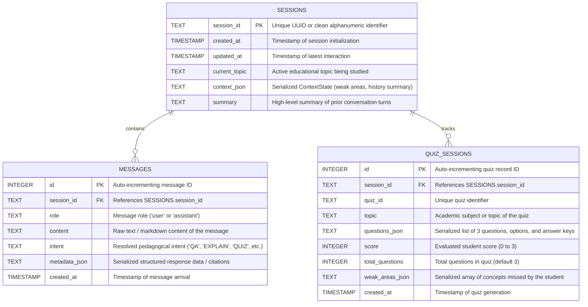

# Phase 3: Project Design Phase — Database Design
## Project: EduGenie — Google Gemini Powered Learning Assistant

---

### 1. Database Overview
EduGenie uses an embedded **SQLite 3** relational database (`edugenie.db`) managed via Python's standard `sqlite3` driver with foreign key constraints, connection pooling, and serialized JSON fields for structured metadata.

- **Engine:** SQLite 3 (Thread-safe, zero server management, zero external credentials)
- **Location:** `c:\kishoreProject\EduGenie\edugenie.db` (configurable via `EDUGENIE_DB_PATH`)
- **Key Purpose:** Persist multi-turn conversation history, learning context state, and active quiz evaluations across server restarts.

---

### 2. Entity-Relationship Model

---

### 3. Detailed Table Specifications

#### Table 1: `sessions`
Stores metadata and context states for conversational sessions.

| Column | Data Type | Constraints | Description |
| :--- | :--- | :--- | :--- |
| `session_id` | `TEXT` | `PRIMARY KEY` | Alphanumeric unique identifier (e.g., `session_f590c4a85c9d`). |
| `created_at` | `TIMESTAMP` | `DEFAULT CURRENT_TIMESTAMP` | Initial session creation time. |
| `updated_at` | `TIMESTAMP` | `DEFAULT CURRENT_TIMESTAMP` | Time of the most recent message in the session. |
| `current_topic`| `TEXT` | `NULLABLE` | Tracks active topic (e.g., *"Polymorphism in Java"*). |
| `context_json` | `TEXT` | `NULLABLE` | JSON blob storing session memory state. |
| `summary` | `TEXT` | `NULLABLE` | Rolling distilled conversational memory. |

#### Table 2: `messages`
Stores sequential conversational turns between the student and the AI tutor.

| Column | Data Type | Constraints | Description |
| :--- | :--- | :--- | :--- |
| `id` | `INTEGER` | `PRIMARY KEY AUTOINCREMENT` | Unique sequential message record. |
| `session_id` | `TEXT` | `NOT NULL, FK -> sessions(session_id)` | Session ownership with `ON DELETE CASCADE`. |
| `role` | `TEXT` | `NOT NULL` | Either `'user'` or `'assistant'`. |
| `content` | `TEXT` | `NOT NULL` | Message body (supports GitHub-flavored Markdown). |
| `intent` | `TEXT` | `NULLABLE` | Intent classification tag. |
| `metadata_json`| `TEXT` | `NULLABLE` | Structured payload (e.g., quiz questions, learning path tiers). |
| `created_at` | `TIMESTAMP` | `DEFAULT CURRENT_TIMESTAMP` | Creation timestamp. |

#### Table 3: `quiz_sessions`
Maintains interactive quiz state, options, and evaluation scoring.

| Column | Data Type | Constraints | Description |
| :--- | :--- | :--- | :--- |
| `id` | `INTEGER` | `PRIMARY KEY AUTOINCREMENT` | Unique quiz entry ID. |
| `session_id` | `TEXT` | `NOT NULL, FK -> sessions(session_id)` | Session association with `ON DELETE CASCADE`. |
| `quiz_id` | `TEXT` | `NOT NULL` | Unique identifier generated for the 3-question set. |
| `topic` | `TEXT` | `NOT NULL` | Subject under test. |
| `questions_json`| `TEXT`| `NOT NULL` | Full serialized array of questions, options, and correct answers. |
| `score` | `INTEGER` | `NULLABLE` | Recorded score after answer submission. |
| `total_questions`|`INTEGER`| `DEFAULT 3` | Question count. |
| `weak_areas_json`|`TEXT` | `NULLABLE` | Concepts flagged for remedial revision. |
| `created_at` | `TIMESTAMP` | `DEFAULT CURRENT_TIMESTAMP` | Generation timestamp. |

---

### 4. Data Security & Integrity Controls
1. **Parameterized Queries:** All SQL statements use `?` parameter bindings to eliminate SQL injection vulnerabilities.
2. **Session ID Sanitization:** `validate_session_id()` enforces a strict alphanumeric and hyphen/underscore whitelist ($1\text{--}64$ characters).
3. **Bounded Context Retrieval:** History queries enforce a strict `LIMIT 10` boundary to ensure prompt tokens remain bounded and responses execute rapidly.
4. **Foreign Key Enforcement:** Enabled via `PRAGMA foreign_keys = ON` ensuring orphan cleanup when sessions are purged.
5. **Git Exclusion:** `edugenie.db` and all `*.sqlite*` files are strictly ignored by `.gitignore`.
