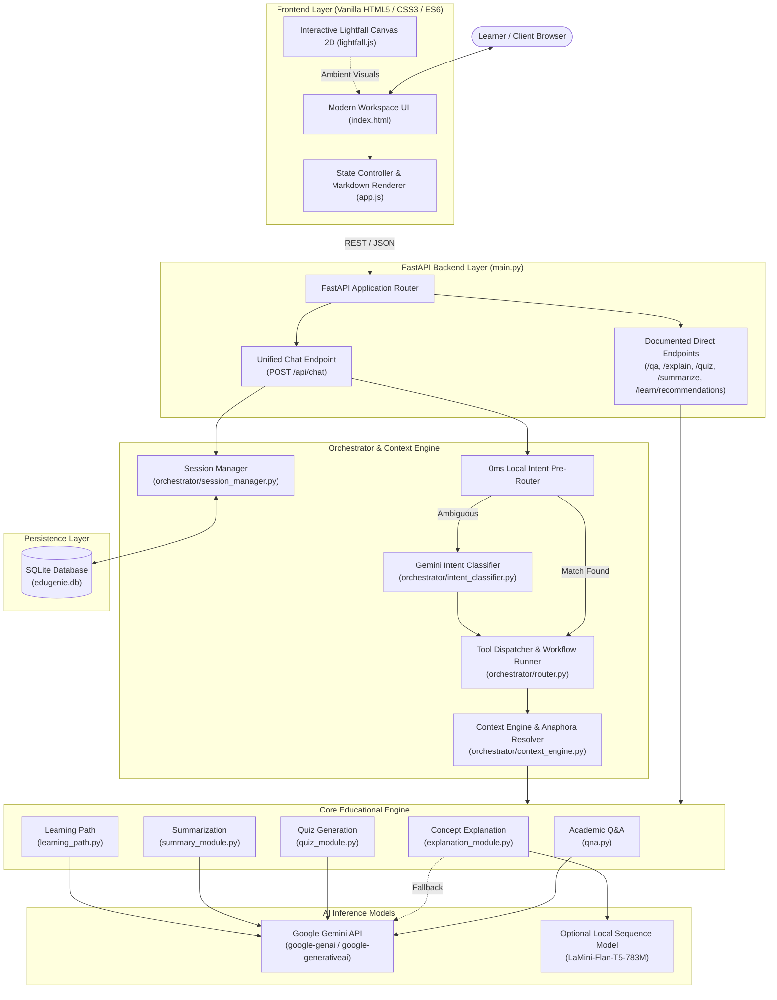

# Phase 3: Project Design Phase — System Architecture
## Project: EduGenie — Google Gemini Powered Learning Assistant

---

### 1. High-Level Architecture Overview
EduGenie employs a decoupled, asynchronous client-server architecture built on **FastAPI** (Python 3.12) and modern **Vanilla HTML5/CSS3/JavaScript**. The application supports both direct legacy REST endpoints and an intelligent conversational pipeline orchestrating educational capabilities through Google Gemini.

---

### 2. Layer-by-Layer Architectural Breakdown

#### A. Frontend Presentation Layer
- **Architecture:** Zero-framework single-page application (SPA) architecture avoiding npm/Webpack build complexity.
- **Components:**
  - `templates/index.html`: Semantic markup containing the header, welcome hero, scrollable message stream, and docked input composer.
  - `static/style.css`: Modular design system using CSS custom properties (`--bg-base: #050510`, `--accent-indigo`, `--accent-cyan`), fluid typography, glassmorphism surfaces, and media queries.
  - `static/app.js`: Encapsulated application controller managing asynchronous fetch operations, real-time message stream insertion, Markdown parsing, and interactive quiz selection.
  - `static/lightfall.js`: Standalone GPU-accelerated HTML5 Canvas 2D ambient background rendering continuous curved light trails with 3-tier perspective depth and user pointer interactions.

#### B. API Routing Layer (`main.py`)
- Built on **FastAPI** leveraging Pydantic v2 schemas for strict request/response data validation.
- **Dual Routing Paradigm:**
  1. **Direct Documented Endpoints:** Preserves programmatic access to `/qa`, `/explain`, `/quiz`, `/summarize`, and `/learn/recommendations`.
  2. **Conversational Orchestrator Endpoint (`POST /api/chat`):** Consumes multi-turn conversational messages, resolves sessions, and orchestrates educational responses.

#### C. Intelligent Orchestrator & Context Engine
- **Fast Local Pre-Router:** Uses deterministic regular expressions and keyword maps to classify unambiguous intents (`"quiz on python"`, `"explain recursion"`, `"summarize this"`) in $< 1\text{ ms}$ without incurring network latency.
- **Gemini Intent Classifier:** Invoked for complex or conversational prompts to detect intent (`QA`, `EXPLAIN`, `QUIZ`, `SUMMARIZE`, `LEARNING_PATH`, `MULTI_ACTION`, `CLARIFICATION`, `UNKNOWN`).
- **Context Engine (`orchestrator/context_engine.py`):** Inspects prior session messages to resolve pronoun and anaphoric references (e.g., turning *"explain that simpler"* into an explanation of the topic discussed in the previous message).
- **Active Quiz Evaluator:** Intercepts quiz answer submissions (e.g., *"A"*, *"The correct answer is 2"*), compares against stored answer keys, updates user score, and provides instant pedagogical feedback.

#### D. Core Educational Engine
- Five decoupled Python modules containing pure educational business logic:
  - `qna.py`: Direct Google Gemini query generation.
  - `explanation_module.py`: High-clarity conceptual breakdown using real-world analogies. Integrates automatic fallback from local `LaMini-Flan-T5-783M` to Gemini.
  - `quiz_module.py`: Structured 3-question MCQ generation with JSON extraction and schema validation.
  - `summary_module.py`: Key points extraction and 3-sentence summary condensation.
  - `learning_path.py`: Structured multi-level roadmap generation (Beginner, Intermediate, Advanced).

#### E. AI Model & Inference Layer (`config.py`)
- Standardized wrapper supporting modern `google.genai` SDK and legacy `google-generativeai`.
- Automatic model fallback sequence ensures that if a model endpoint (e.g., `gemini-2.5-flash`) encounters a 404 or rate limit, requests automatically cascade to working active models (e.g., `gemma-4-26b-a4b-it`) without crashing.

#### F. Storage & Persistence Layer (`orchestrator/session_manager.py`)
- Backed by an embedded **SQLite** database (`edugenie.db`) with an automated in-memory fallback for ephemeral environments.
- Ensures conversations survive application restarts.
