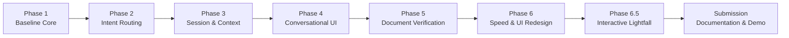

# Phase 4: Project Planning Phase — Development Roadmap & Execution Plan
## Project: EduGenie — Google Gemini Powered Learning Assistant

---

### 1. Planning Methodology
The development of EduGenie followed an **Iterative, Test-Verified Agile Lifecycle** with a strict document-first baseline verification. Each milestone built progressively on the verified foundation of preceding phases, ensuring no regression of core capabilities while modernizing the user experience.

---

### 2. Actual Development Progression

---

### 3. Detailed Phase Breakdown

#### Phase 1: Baseline Architecture & Core Implementation
- **Key Deliverables:**
  - Setup of FastAPI backend with structured Pydantic schemas.
  - Development of five standalone educational modules: `qna.py`, `explanation_module.py`, `quiz_module.py`, `summary_module.py`, and `learning_path.py`.
  - Integration of Google Gemini API via `google-genai` and `google-generativeai`.
  - Optional local Hugging Face transformer pipeline (`LaMini-Flan-T5-783M`) with automatic Gemini fallback.
  - Implementation of five direct REST endpoints: `/qa`, `/explain`, `/quiz`, `/summarize`, `/learn/recommendations`.
- **Outcome:** Functional standalone educational utilities verified via baseline unit tests.

#### Phase 2: Intent Classification & Orchestration
- **Key Deliverables:**
  - Creation of the `orchestrator/` subsystem.
  - Implementation of `orchestrator/intent_classifier.py` leveraging Gemini for natural language intent detection (`QA`, `EXPLAIN`, `QUIZ`, `SUMMARIZE`, `LEARNING_PATH`, `MULTI_ACTION`, `CLARIFICATION`, `UNKNOWN`).
  - Dynamic tool dispatcher in `orchestrator/router.py` invoking core modules without code duplication.
  - Implementation of deterministic multi-action workflows (e.g., Summarize $\rightarrow$ Quiz).
  - Unified conversational endpoint: `POST /api/chat`.
- **Outcome:** Natural language conversation routing operational.

#### Phase 3: Session State & Conversational Context
- **Key Deliverables:**
  - Implementation of SQLite persistence layer in `orchestrator/session_manager.py` with schema for `sessions`, `messages`, and `quiz_sessions`.
  - Development of `orchestrator/context_engine.py` to resolve anaphoric follow-up references (*"explain that simpler"*, *"give an example of it"*, *"quiz me on that"*).
  - Interactive quiz session evaluation: tracking active quizzes, validating user answers, calculating scores, and storing weak areas.
  - Endpoints for session initialization (`POST /api/session`) and history retrieval (`GET /api/session/{session_id}/history`).
- **Outcome:** State persistence across server restarts and conversational memory established.

#### Phase 4: Unified Conversational Frontend
- **Key Deliverables:**
  - Replacement of fragmented multi-form page with a single-composer chat UI in `templates/index.html`.
  - Client-side application controller `static/app.js` with asynchronous message dispatch, auto-scroll, and Markdown rendering.
  - Interactive clickable quiz cards with immediate visual answer evaluation.
  - Task selector chips beneath composer for optional manual capability override.
- **Outcome:** Unified single-window educational assistant interface.

#### Phase 5: Document-First Core Verification & Gemini Stabilization
- **Key Deliverables:**
  - Freeze of UI modifications to conduct rigorous requirement verification against original specification.
  - Stabilization of Gemini API integration with active model fallback chain (`gemini-2.5-flash` $\rightarrow$ `gemma-4-26b-a4b-it`).
  - Development and execution of bounded document requirement verification suite (`test_document_requirements.py`).
  - Verification of all five core capabilities and all five documented direct endpoints.
- **Outcome:** 100% verification (7/7 tests passed) of original project document requirements.

#### Phase 6: Response Speed Optimization & Visual Refinement
- **Key Deliverables:**
  - Performance audit identifying intent classification overhead on simple requests.
  - Implementation of zero-latency local keyword pre-router resolving unambiguous queries in $< 1\text{ ms}$.
  - Deep visual redesign in `static/style.css`: Deep Space (`#050510`) dark theme, centered welcome hero, polished typography, and refined composer dock.
- **Outcome:** Instant intent routing and modern AI-native workspace appearance.

#### Phase 6.5: Interactive Cinematic Lightfall Background
- **Key Deliverables:**
  - Development of `static/lightfall.js` using pure Canvas 2D without third-party dependencies.
  - Cinematic light rain effect with continuous curved Bezier trails flowing diagonally (~26°).
  - 3-tier perspective depth with bright leading flares and soft luminous tails.
  - Interactive pointer deflection and gentle aura illumination.
  - Automatic chat-mode dimming (1.0 to 0.45 opacity) and accessibility support for `prefers-reduced-motion`.
- **Outcome:** Ambient visual identity verified via high-resolution browser screenshots.

---

### 4. Remaining Submission Activities
1. **Compilation of 8-Phase Documentation Package:** Complete documentation across all required SmartBridge phases.
2. **Visual Evidence Gathering:** Curate real browser screenshots verifying key states.
3. **Demonstration Script & Video Walkthrough Preparation:** Formulate a structured 6–10 minute presentation script and checklist.
4. **Git Repository Hygiene:** Ensure `.env`, database files, and system artifacts are cleanly excluded by `.gitignore` prior to public GitHub release.
